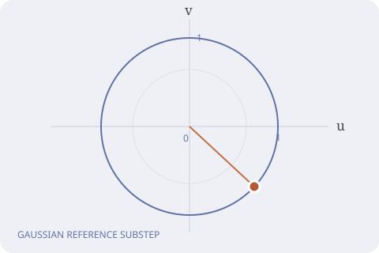

# NicoStan


[Installation](#installation) · [Examples](#examples) · [Algorithms](#trajectory-length-adaptation) · [References](#references)


NicoStan is an R package for fitting Bayesian models written in Stan. 
It combines adaptive Hamiltonian Monte Carlo (HMC) with a hybrid diffusion-pathspace algorithm for models containing large blocks of
latent variables or nuisance parameters. 
Stan/BridgeStan provide the log posterior and its gradients, whilst NicoStan handles warm-up, sampling and posterior summaries.


Note that NicoStan can also fit any Stan model (`.stan` model files); however, expect efficiency gains to be less dramatic for models without nuisance parameters.


The R package provides:


- **A general Stan interface**, so existing Stan models can be fitted through NicoStan.
- **Hybrid diffusion-pathspace HMC** for models with suitable Gaussian latent/nuisance blocks, based on [Beskos et al. (2011)](https://doi.org/10.1016/j.spa.2011.06.003) and [Beskos et al. (2013)](https://doi.org/10.1016/j.spa.2012.12.001).
- **ChEES, ChEES-R and SNAPER trajectory-length adaptation**, drawing on [Hoffman et al. (2021)](https://proceedings.mlr.press/v130/hoffman21a.html) and [Sountsov and Hoffman (2022)](https://arxiv.org/abs/2110.11576v3), alongside our log-CHESSR formulation.
- **Custom AVX2 and AVX-512 mathematical functions**, supplied through the BayesMVP extension and available to general Stan models.
- **Parallel chains, diagonal/dense main-parameter metrics, posterior summaries and MCMC diagnostics.**


NicoStan grew out of our work on efficient sampling for multivariate probit models and their latent-class extensions for the evaluation 
of diagnostic/screening test accuracy without a perfect gold standard.
The [BayesMVP extension](https://github.com/CerulloE1996/BayesMVP) adds specialised implementations,
with manually implemented gradients. 
Applications include: 
the latent-class MVP (LC-MVP) vs. latent-trait simulation study in [Cerullo et al. (2025)](https://arxiv.org/abs/2509.18489v1).


## Performance


In our initial tests on models with high-dimensional nuisance parameters/blocks, 
NicoStan has achieved speed-ups (relative to Stan, using cmdstanr) of more than **10×, without enabling AVX**. 
These gains come from the sampler and its adaptation;
furthermore, the custom AVX functions provide an additional route to reducing the cost of model evaluation.


**Detailed benchmarks are coming soon.** The comparisons will cover:


- Plain Stan (via the cmdstanr R package), fitted using the default NUTS-HMC-based ([Hoffman and Gelman, 2014](https://www.jmlr.org/papers/v15/hoffman14a.html)) algorithm.
- NicoStan; using the same Stan model and ordinary Stan mathematical functions.
- NicoStan; with our custom AVX-2 and/or AVX-512 functions on supported hardware.


The comparison examples use the same data, priors and initial values across these benchmarks. 
Results will report sampling efficiency; more specifically: 
sampling ESS/sec,
time to min ESS of 100, 1000 and 10,000,
and sampling ESS/grad.
Additionally, it will report burnin/warm-up costs,
as well as convergence diagnostics (e.g. R-hat, nR-hat; [Margossian et al., 2024](https://arxiv.org/abs/2110.13017v6)),
alongside the computational settings.


## How NicoStan works


Many Bayesian models contain a relatively small set of parameters of direct interest, 
and a much larger (i.e., high-dimensional) set of latent variables. 
Examples include:
models with subject-specific random effects, 
unobserved volatility trajectories, 
Gaussian process values, 
as well as auxiliary variables introduced to evaluate a likelihood. 
As the latent block grows, moving through the joint posterior becomes increasingly expensive.


NicoStan exploits a Gaussian representation of this block. 
For instance, a non-centred random effect can be written as:

`x = μ(θ) + L(θ)u`,


where: `u ~ N(0, I)` and θ contains the main parameters. 


The negative log posterior then has the form:
`U(θ, u) = Φ(θ, u) + uᵀu / 2`.


The hybrid/joint sampler implemented in NicoStan combines:


- Standard (with randomized path length) HMC dynamics for the main model parameters.
- Diffusion-pathspace HMC (based on [Beskos et al., 2013](https://doi.org/10.1016/j.spa.2012.12.001)), 
for the high-dimensional nuisance parameters.


Our main reference for **diffusion-pathspace HMC** is
[Beskos, Kalogeropoulos and Pazos (2013)](https://doi.org/10.1016/j.spa.2012.12.001),
Advanced MCMC methods for sampling on diffusion pathspace, building on the Hilbert-space HMC formulation of
[Beskos, Pinski, Sanz-Serna and Stuart (2011)](https://doi.org/10.1016/j.spa.2011.06.003).
The Gaussian reference flow is integrated exactly, avoiding integration error in that component of the Hamiltonian. 


The joint scheme, in which the main parameters and the latent block move together within one trajectory, 
follows [Beskos et al. (2015)](https://doi.org/10.1093/biomet/asv051), who use it for joint inference on model parameters and latent paths.


Related developments include:

- **Hilbert-space HMC with Ornstein-Uhlenbeck bridge velocities:** [Pinski (2021)](https://doi.org/10.3390/e23050499) chooses a mass operator that gives the augmented velocities an Ornstein-Uhlenbeck bridge distribution for path sampling.
- **Pseudo-marginal HMC:** [Alenlöv et al. (2021)](https://jmlr.org/papers/v22/19-486.html) jointly update the model parameters and Gaussian auxiliary variables used to construct an unbiased likelihood estimator.


For one standard Gaussian coordinate with unit mass, the reference flow is a rotation:


```text
u(t) = u(0) cos(t) + v(0) sin(t)
v(t) = v(0) cos(t) - u(0) sin(t)
```




The [interactive reference-flow illustration](https://cerulloe1996.github.io/NicoStan/#reference-flow) shows this substep for one standard normal coordinate. The illustration follows one Gaussian reference substep.


Note that NicoStan's default differs from this textbook case (a rotation about zero, with unit mass) in two ways:

- **Shifted centre:** the rotation is about a centre `c` rather than zero, i.e., the Gaussian reference is `N(c, I)`. 
During burn-in, `c` is a running estimate of the posterior mean of the nuisance/latent block (averaged across chains). 
It is then frozen (`theta_hat_us_rule = "running_mean_frozen"`), so that the step size finishes adapting against the same centre used for sampling. 
The textbook centre is also available (`theta_hat_us_rule = "zero"`).
- **Nuisance mass:** the nuisance coordinates have a diagonal mass. 
With `metric_type_nuisance = "Empirical"` each coordinate has its own mass `m_j`, estimated from its variance during burn-in, 
whilst `"uniform_diag"` uses a single common mass (the median across coordinates) for the whole block, 
and `"unit"` fixes every mass at 1 (i.e., the textbook case).


For nuisance coordinate j, the reference flow then becomes:


```text
u_j(t) = c_j + (u_j(0) - c_j) cos(t/√m_j) + √m_j v_j(0) sin(t/√m_j)
v_j(t) = v_j(0) cos(t/√m_j) - (u_j(0) - c_j) sin(t/√m_j) / √m_j
```


The centre and mass only change the Gaussian reference used in the splitting, not the target; 
the kick step absorbs the difference, hence the sampler still targets the exact posterior for any choice of `c` and `m`.


The current hybrid/joint diffusion HMC integrator uses a "kick-flow-kick" splitting 
(the same ordering as [Beskos et al., 2013](https://doi.org/10.1016/j.spa.2012.12.001), eq. 19; [2015](https://doi.org/10.1093/biomet/asv051), eq. 16). 
Furthermore, the HMC trajectory-length adaptation during burnin (e.g. SNAPER-HMC, CHESSR-HMC, etc) 
uses the main parameters; hence, a large nuisance block does not dominate the adaptation criterion.


Furthermore, note that models without a Gaussian latent block/nuisance parameters are still supported - 
they use NicoStan's standard HMC sampler.


## Models with nuisance parameters


Gaussian latent/nuisance representations occur in many commonly-used models, 
either directly, or through non-centred parameterisations:

- **Stochastic volatility:** innovations driving the latent log-volatility process.
- **State-space models and partially observed diffusions:** state innovations or a non-centred driving path.
- **Generalised linear mixed models:** Gaussian random intercepts and slopes.
- **Gaussian processes and spatial models:** non-centred function values or spatial effects.
- **Log-Gaussian Cox processes:** a Gaussian latent log-intensity field.
- **Survival analysis with frailty:** Gaussian log-frailties, giving multiplicative lognormal frailty.
- **Joint longitudinal and survival models:** shared random effects or latent trajectories.
- **Factor models and item-response models:** latent factors or abilities.
- **Measurement-error models:** unobserved covariates or residual processes.
- **Hierarchical meta-analysis:** Gaussian study effects.
- **MVP, LC-MVP, MVOP and LC-MVOP:** latent-Gaussian/auxiliary-variable representations for correlated binary and ordinal outcomes.


The diffusion-pathspace applications in
[Beskos et al. (2013)](https://doi.org/10.1016/j.spa.2012.12.001) 
include diffusion bridges, stochastic volatility and latent diffusion survival models. 


Further parameterisation examples are given in the Stan User's Guide sections on
[stochastic volatility](https://mc-stan.org/docs/2_33/stan-users-guide/stochastic-volatility-models.html),
[Gaussian processes](https://mc-stan.org/docs/stan-users-guide/gaussian-processes.html) and
[reparameterisation](https://mc-stan.org/docs/stan-users-guide/efficiency-tuning.html).


When preparing a model for NicoStan:

- Declare the nuisance block **first in the Stan parameters block**.
- Use `sample_nuisance = TRUE` for this model; use `FALSE` for a model without a nuisance block.
- NicoStan automatically detects its unconstrained dimension from the Stan compiler metadata and BridgeStan.
- For a Gaussian representation, use standard normal variables in this first block and introduce scales/correlations in transformed parameters.
- Keep the complete posterior density, including the nuisance prior, in the Stan program.


## Trajectory-length adaptation


Use `burnin_algorithm` to choose the trajectory-length adaptation rule:


- `CHESSR` (ChEES-R): The original ChEES-rate criterion, using the squared change in the main block's centred squared radius per realised trajectory length.
- `CHESSR_log` (Log-ChEES-R): Our log-ratio formulation, which normalises the numerator gradient by a running average of the ChEES numerator.
- `SNAPER` (SNAPER): Learns a difficult main-parameter direction with a metric-aware Oja update and adapts the trajectory length using squared changes along that direction per unit length.
- `ChEES` (ChEES): Uses the squared change in the main block's centred squared radius, without dividing by trajectory length.


ChEES measures squared changes in the centred squared radius of the parameter vector 
([Hoffman et al., 2021](https://proceedings.mlr.press/v130/hoffman21a.html)). 
ChEES-R (the ChEES-Rate criterion of [Sountsov and Hoffman, 2022](https://arxiv.org/abs/2110.11576v3)) 
divides this change by the trajectory length, so that the cost of longer trajectories is taken into account. 
SNAPER-HMC ([Sountsov and Hoffman, 2022](https://arxiv.org/abs/2110.11576v3))
focuses the corresponding criterion along the first principal component 
(i.e., the direction of largest variance, which is typically the most difficult to explore), 
learned during warm-up with Oja's algorithm.


The position-based criteria use the main parameters in coordinates defined by the current mass matrix 
(as in [Riou-Durand et al., 2023](https://proceedings.mlr.press/v206/riou-durand23a.html)).
If `BᵀB = M`, these coordinates are `z = B(θ - μ)`. 
Both diagonal and dense main-parameter metrics are supported,
and SNAPER-HMC learns its direction in the same coordinates.


`CHESSR_log` is our log-ratio formulation of the ChEES rate,
using a running average of the numerator to normalise its gradient.
Both `CHESSR` and `CHESSR_log` adapt a positive trajectory length on the log scale.
Their update rules differ, so both are available in NicoStan; 
the derivation is given in the [adaptation notes](docs/adaptation-notes.md).


The burnin and sampling phase defaults are the following:


- **Burn-in:** fixed length for each transition at the current tuning setting.
Adaptation can change that setting between iterations.
- **Post-burn-in sampling:** randomised trajectory length - drawn uniformly between zero and twice the adapted scale -
with at least one integration step.


The controls are `randomize_tau_burnin = FALSE` and `randomize_tau_sampling = TRUE`.


`manual_tau` separately controls whether the trajectory length is adapted.


## Custom AVX2 and AVX-512 functions


NicoStan uses our custom vectorised mathematical functions through the BayesMVP extension.
These include for instance: 
exponentials (exp()), 
logarithms (log()), 
normal distribution functions (e.g., Phi(), inv_Phi(), Phi_approx(), inv_Phi_approx()), 
as well as their derivatives.


- **AVX2:** four double-precision values per vector operation; supported by many x86 CPUs.
- **AVX-512:** eight double-precision values per vector operation on supported processors.
- **General Stan models:** declare the external functions in Stan and supply the header via `Stan_cpp_user_header`.
- **Specialised BayesMVP models:** the same kernels are used within the native implementations.


The example suite has separate `math_backend = "Stan"`, `"AVX2"` and `"AVX512"` choices. 
The compiled AVX model reports its lane count, so the selected implementation can be checked directly. 
Compile on the machine used for sampling, with the instruction sets supported by that machine. 
[Intel's processor guidance](https://www.intel.com/content/www/us/en/support/articles/000090473/processors/intel-core-processors.html) 
describes how to check the advertised extensions.


## Examples


The general examples are grouped by their parameterisation:


- **Joint HMC with nuisance diffusion:** Cox shared frailty, hierarchical logistic regression,
joint longitudinal-survival modelling and stochastic volatility.
- **Ordinary HMC:** Weibull survival regression, robust Student-t regression and marginal Gaussian process (GP) regression. 
Note that the GP example analytically integrates out the latent function, and the Student-t example evaluates its likelihood directly.


The logistic random-intercept example gives a short introduction to the API:


```r
source(system.file("examples", "random_intercepts.R", package = "NicoStan"))
fit <-  run_random_intercepts(burnin_algorithm = "CHESSR")
diagnostics <-  fit$summary(save_log_lik_trace = FALSE)
fit$model_fit_object$summaries$summary_tibbles$summary_tibble_main_params

## Other trajectory-length adaptation options:
## "CHESSR_log", "SNAPER", "ChEES"
```


It simulates 20 groups and 200 observations, with a standard normal latent vector declared first in the Stan model. 
See the complete [R example](inst/examples/random_intercepts.R) and [Stan model](inst/examples/random_intercepts.stan)
for the parameterisation and settings. 
The R6 class is called `MVP_model` for compatibility; 
`Model_type = "Stan"` selects the general Stan interface.


The wider comparison examples are available through:


```r
source(system.file("examples", "paper3_examples.R", package = "NicoStan"))
result <-  run_paper3_example(model = "hierarchical_logistic",
                              engine = "NicoStan", math_backend = "Stan")
```


To compare implementations:


- Use `engine = "cmdstanr"` for Stan/NUTS.
- Use `engine = "NicoStan", math_backend = "Stan"` for NicoStan with ordinary Stan mathematics.
- Use `engine = "NicoStan", math_backend = "AVX512"` for NicoStan with the AVX-512 functions.


The output records model/data fingerprints, sampler settings, posterior summaries and timings. 
Model definitions, prior scales and validation results accompany the examples.

## BayesMVP: multivariate probit models


The [BayesMVP extension](https://github.com/CerulloE1996/BayesMVP) provides specialised implementations, 
with manually implemented likelihood gradients for:


- **MVP:** multivariate probit, using `Model_type = "MVP"`.
- **2LC-MVP:** two-class multivariate probit, using `Model_type = "LC_MVP"`.
- **MVOP:** multivariate ordinal probit, using `Model_type = "MVOP"`.
- **2LC-MVOP:** two-class multivariate ordinal probit, using `Model_type = "LC_MVOP"`.
- **Latent trait:** the two-class implementation, using `Model_type = "latent_trait"`.


These models are useful for correlated binary/ordinal outcomes, and for estimating test accuracy 
when a perfect reference standard is unavailable. 


The ordinal latent-class model is described by [Cerullo et al. (2022)](https://doi.org/10.1002/jrsm.1567).
Furthermore, [Cerullo et al. (2025)](https://arxiv.org/abs/2509.18489v1) compare the latent-class MVP and latent-trait models 
in a simulation study fitted using BayesMVP.


The **4LC-MVOP** model handles two related latent conditions.
It has a Stan implementation and a partial-manual-gradient/fused-function version.
Its partial-manual-gradient implementation runs through Stan/NicoStan,
whilst the five models above also have native BayesMVP implementations. 
Development and applications of 4LC-MVOP are covered in separate papers, 
whilst the model also provides a larger example for the general NicoStan sampler.


## Installation


NicoStan requires:


- An R installation, a C++17 compiler and GNU make.
- The CmdStanR interface and CmdStan C++ source tree. 
See the [CmdStanR installation guide](https://mc-stan.org/cmdstanr/articles/cmdstanr.html).
- The BridgeStan R interface and matching C++ library. 
See the [BridgeStan installation guide](https://roualdes.us/bridgestan/latest/languages/r.html).


The current development build uses CmdStan 2.36.0 and BridgeStan 2.6.2. 

The tested Linux setup uses R 4.3.3 and GCC 11.4, 
with the C++ source trees at `~/.cmdstan/cmdstan-2.36.0` and `~/.bridgestan/bridgestan-2.6.2`.

For a local source checkout, use the administrator installer in `inst/examples`:


```r
source("path/to/NicoStan/inst/examples/NicoStan_admin_install.R")
```

Restart R after installation, then load `library(NicoStan)`.

The example sources are in `R_packages/NicoStan/inst/examples`; 
installation copies them into the compiled package.


For installation from GitHub, start with a fresh R session and a writable package library:

```r
install.packages(c("remotes", "devtools"))
remotes::install_github(repo = "CerulloE1996/NicoStan", upgrade = "never")
NicoStan::install_NicoStan()
## Restart R, then load library(NicoStan).
```

The first installation supplies the outer package and its installer. `install_NicoStan()` then compiles and installs the sampler. Restart R before switching between installed and development copies.

The AVX and native-model examples additionally require the NicoStan-compatible BayesMVP extension.
After installing NicoStan, run the following in a fresh R session:

```r
remotes::install_github(repo = "CerulloE1996/BayesMVP",
                        ref = "nicostan-extension-2026-09-21", upgrade = "never")
BayesMVP::install_BayesMVP()
## Restart R before loading the compiled BayesMVP package.
```

This command selects the [NicoStan extension branch](https://github.com/CerulloE1996/BayesMVP/tree/nicostan-extension-2026-09-21).


## References


The papers cited above cover the HMC/pathspace methods, trajectory-length adaptation and statistical applications. [Riou-Durand et al. (2023)](https://proceedings.mlr.press/v206/riou-durand23a.html) study adaptive tuning for **Metropolis Adjusted Langevin Trajectories (MALT)**, a separate sampler based on kinetic Langevin dynamics.


1. Beskos, A., Pinski, F. J., Sanz-Serna, J. M. and Stuart, A. M. (2011). [Hybrid Monte Carlo on Hilbert spaces](https://doi.org/10.1016/j.spa.2011.06.003). Stochastic Processes and Their Applications, 121(10), 2201-2230.

2. Beskos, A., Kalogeropoulos, K. and Pazos, E. (2013). [Advanced MCMC methods for sampling on diffusion pathspace](https://doi.org/10.1016/j.spa.2012.12.001). Stochastic Processes and Their Applications, 123(4), 1415-1453.

3. Beskos, A., Dureau, J. and Kalogeropoulos, K. (2015). [Bayesian inference for partially observed stochastic differential equations driven by fractional Brownian motion](https://doi.org/10.1093/biomet/asv051). Biometrika, 102(4), 809-827.

4. Alenlöv, J., Doucet, A. and Lindsten, F. (2021). [Pseudo-Marginal Hamiltonian Monte Carlo](https://jmlr.org/papers/v22/19-486.html). Journal of Machine Learning Research, 22(141), 1-45.

5. Hoffman, M. D., Radul, A. and Sountsov, P. (2021). [An Adaptive-MCMC Scheme for Setting Trajectory Lengths in Hamiltonian Monte Carlo](https://proceedings.mlr.press/v130/hoffman21a.html). Proceedings of Machine Learning Research, 130, 3907-3915.

6. Sountsov, P. and Hoffman, M. D. (2022). [Focusing on Difficult Directions for Learning HMC Trajectory Lengths](https://arxiv.org/abs/2110.11576v3). arXiv:2110.11576, version 3, 6 May 2022.

7. Pinski, F. J. (2021). [A Novel Hybrid Monte Carlo Algorithm for Sampling Path Space](https://doi.org/10.3390/e23050499). Entropy, 23(5), 499.

8. Riou-Durand, L., Sountsov, P., Vogrinc, J., Margossian, C. and Power, S. (2023). [Adaptive Tuning for Metropolis Adjusted Langevin Trajectories](https://proceedings.mlr.press/v206/riou-durand23a.html). Proceedings of Machine Learning Research, 206, 8102-8116.

9. Cerullo, E., Jones, H. E., Carter, O., Quinn, T. J., Cooper, N. J. and Sutton, A. J. (2022). [Meta-analysis of dichotomous and ordinal tests with an imperfect gold standard](https://doi.org/10.1002/jrsm.1567). Research Synthesis Methods, 13(5), 595-611.

10. Cerullo, E., Pinkney, S., Sutton, A. J., Lucas, T., Cooper, N. J. and Jones, H. E. (2025). [Latent class multivariate probit and latent trait models for evaluating test accuracy without a gold standard: A simulation study](https://arxiv.org/abs/2509.18489v1). arXiv:2509.18489, version 1, 23 September 2025.

11. Hoffman, M. D. and Gelman, A. (2014). [The No-U-Turn Sampler: Adaptively Setting Path Lengths in Hamiltonian Monte Carlo](https://www.jmlr.org/papers/v15/hoffman14a.html). Journal of Machine Learning Research, 15(47), 1593-1623.

12. Margossian, C. C., Hoffman, M. D., Sountsov, P., Riou-Durand, L., Vehtari, A. and Gelman, A. (2024). [Nested R-hat: Assessing the convergence of Markov chain Monte Carlo when running many short chains](https://arxiv.org/abs/2110.13017v6). Bayesian Analysis; arXiv:2110.13017, version 6, 30 May 2024.


## Package citation and development


NicoStan is developed by Enzo Cerullo and licensed under GPL-3.
Package citation metadata is provided in [CITATION.cff](CITATION.cff), 
and the references above are available as a [BibTeX file](docs/references.bib).


The source includes the example models and validation scripts.
The README and website share the same editorial source;
run `python3 tools/build_site.py` after editing the files in `website/`.

